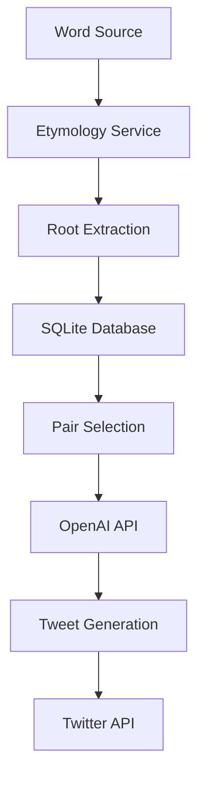

# EtymoBot Current Architecture

## 1. System Overview

EtymoBot is a Python-based Twitter bot that discovers and posts etymological connections between words. The system is designed to be lightweight and deployable through multiple methods.

### 1.1 Core Components



### 1.2 Key Services

1. **EtymologyService**: Web scraping for word origins
2. **SemanticService**: OpenAI embeddings for semantic similarity
3. **OpenAIService**: GPT-4 for tweet generation
4. **TwitterService**: Twitter API v2 integration
5. **DatabaseService**: SQLite persistence

## 2. Deployment Methods

### 2.1 GitHub Actions (Primary)

- **Workflow**: `.github/workflows/etymobot.yml`
- **Schedule**: Runs hourly (`0 * * * *`)
- **Environment**: Ubuntu latest
- **Python Version**: 3.12
- **Database**: SQLite file committed to repository
- **Cache Building**: Automatic if database is empty/small

### 2.2 Docker (Alternative)

- **Base Image**: `python:3.12-slim`
- **Services**:
  - `etymobot`: Main bot service
  - `etymobot-cache-builder`: One-time cache initialization
- **Volume**: `/app/data` for database persistence
- **Environment**: Variables from `.env` file

### 2.3 Local Execution

- **Entry Point**: `main.py`
- **CLI Interface**: `etymobot.cli`
- **Database**: Local SQLite file
- **Environment**: Variables from `.env` or system

## 3. Data Storage

### 3.1 SQLite Database Schema

```sql
-- Root-word mappings
CREATE TABLE rootmap (
    root TEXT,
    word TEXT,
    created_at TIMESTAMP
);

-- Posted pairs tracking
CREATE TABLE posted (
    word1 TEXT,
    word2 TEXT,
    root TEXT,
    tweet_id TEXT,
    posted_at TIMESTAMP
);

-- Failed words tracking
CREATE TABLE failed_words (
    word TEXT,
    failure_count INTEGER,
    last_failure TIMESTAMP
);
```

### 3.2 Data Flow

1. **Cache Building**:
   - Scrapes etymologies
   - Extracts roots
   - Stores in `rootmap` table

2. **Pair Selection**:
   - Queries `rootmap` for valid pairs
   - Checks `posted` for duplicates
   - Skips words in `failed_words`

3. **State Management**:
   - Records successful posts
   - Tracks failed attempts
   - Maintains posting history

## 4. External Dependencies

### 4.1 APIs

1. **OpenAI API**
   - GPT-4 for tweet generation
   - Embeddings API for semantic similarity
   - Rate limiting and error handling

2. **Twitter API v2**
   - Posting tweets
   - Rate limit management
   - Error handling

### 4.2 Python Dependencies

```toml
# Core Dependencies
python = "^3.10"
openai = "^1.0.0"
tweepy = "^4.14.0"
beautifulsoup4 = "^4.12.0"
requests = "^2.31.0"
numpy = "^1.24.0"

# Development Dependencies
pytest = "^7.4.0"
black = "^23.7.0"
flake8 = "^6.1.0"
mypy = "^1.5.0"
```

## 5. Security Implementation

### 5.1 Credential Management

- **GitHub Secrets** for API keys
- **Environment Variables** for local/Docker
- **No Hardcoded Credentials**

### 5.2 Security Features

1. **API Key Protection**
   - Masked in logs
   - Stored in GitHub Secrets
   - Environment-based configuration

2. **Access Control**
   - Private repository
   - GitHub Actions permissions
   - API rate limiting

## 6. Testing Infrastructure

### 6.1 Test Suite

- **Framework**: pytest
- **Coverage**: pytest-cov
- **Linting**: flake8
- **Type Checking**: mypy

### 6.2 CI Pipeline

- **Workflow**: `.github/workflows/test.yml`
- **Triggers**: Push to main/develop, PRs
- **Python Versions**: 3.10, 3.11, 3.12
- **Test Dependencies**: `requirements-test.txt`

## 7. Monitoring and Logging

### 7.1 Built-in Monitoring

- **Database Statistics**
  - Cache size
  - Posted pairs
  - Failed words

- **System Health**
  - API connectivity
  - Database status
  - Cache health

### 7.2 Logging

- **CLI Output**
  - Verbose mode
  - Error reporting
  - Status updates

- **GitHub Actions Logs**
  - Workflow status
  - Error tracking
  - Performance metrics

## 8. Configuration Management

### 8.1 Environment Variables

```bash
# OpenAI API
OPENAI_API_KEY

# Twitter API v2
TWITTER_BEARER_TOKEN
TWITTER_CONSUMER_KEY
TWITTER_CONSUMER_SECRET
TWITTER_ACCESS_TOKEN
TWITTER_ACCESS_TOKEN_SECRET
```

### 8.2 Runtime Configuration

- **Posting Schedule**: 9 AM, 1 PM, 3 PM EST
- **Cache Size**: Configurable sample size
- **Database Location**: Customizable path
- **Logging Level**: Verbose/quiet modes

## 9. Error Handling

### 9.1 Recovery Strategies

1. **API Failures**
   - Exponential backoff
   - Retry logic
   - Rate limit handling

2. **Word Processing**
   - Failed word tracking
   - Skip problematic words
   - Cache rebuilding

3. **Database Issues**
   - Connection retry
   - Transaction rollback
   - State recovery

## 10. Current Limitations

1. **Scalability**
   - Single-threaded processing
   - SQLite database constraints
   - No horizontal scaling

2. **Reliability**
   - Web scraping dependency
   - Single point of failure
   - Limited error recovery

3. **Maintenance**
   - Manual cache management
   - Basic monitoring
   - Limited analytics 